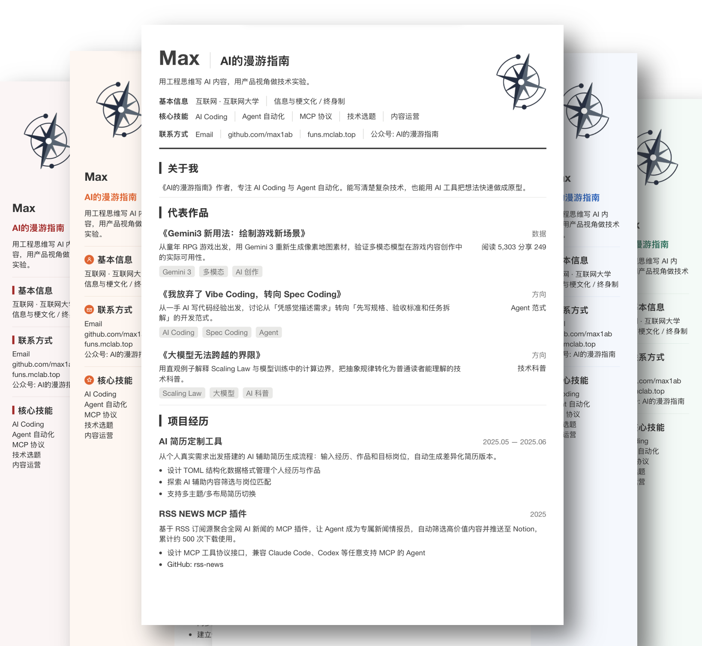

# Resume Writer

> AI 驱动的简历生成器。和你的 Agent 聊出来一份专业简历。



## 一句话介绍

Resume Writer 是可独立发布的 AI Agent Skill。只需和 AI 对话，就能从散乱的资料整理成结构化的简历数据，再一键生成带主题切换、布局选择的 HTML 预览页，浏览器打印直接导出 A4 PDF。

## 特性

- **5 种配色主题**：neutral / classic-blue / academic-red / business-green / creative-orange
- **3 种页面布局**：左栏 / 右栏 / 单栏
- **3 种标题样式**：bar / marker / underline
- **4 种字体选择**：modern / system / serif / compact
- **A4 自适应 + 溢出检测**
- **浏览器直接导出 PDF**，链接可点击

## 支持平台

Claude Code、Cursor、Codex，以及其他支持 skill 的 Agent。

## 安装

```bash
npx skills add max1ab/resume.ai
```

手动安装：将 `resume-writer` 目录复制到对应 IDE 的 skills 目录即可。

- Claude Code: `~/.claude/skills/`
- Cursor: `~/.cursor/skills/`
- Codex: `~/.codex/skills/`

## 推荐工作流

1. **准备资料**：把现有简历、项目介绍、文章链接、GitHub 地址等放到工作目录
2. **对话补充**：告诉 AI 目标岗位、亮点经历、想突出的技能
3. **生成资料文件**：AI 整理成全面的 Markdown 档案，作为「单一数据源」
4. **选样式生成**：选择配色、布局、标题样式，AI 自动构建 HTML 预览
5. **导出 PDF**：浏览器打开 HTML，点击「导出 PDF」，选择「存储为 PDF」即可

> **导出建议**：推荐 Chrome / Edge，纸张 A4、边距无、勾选打印背景。

## 示例 Prompt

**生成简历**
> 帮我做一份简历。资料在 ./assets/ 里，包括我的项目介绍和几篇文章。目标岗位是 AI 内容运营。先帮我整理成一份全面的资料文件，然后生成左栏、蓝色主题的简历预览。

**针对不同岗位调整简历**
> 基于当前资料，帮我针对前端工程师和 AI 应用开发工程师两个岗位生成两份不同的简历，各自突出匹配的侧重点。

**优化内容**
> 这份简历的项目经历描述不够有冲击力，帮我改得更量化、更结果导向一些。

## 快速开始（开发者）

```bash
# 侧栏布局示例
node resume-writer/scripts/build.mjs resume-writer/examples/sample-resume.json
open resume-writer/examples/sample-resume.html

# 单栏布局示例
node resume-writer/scripts/build.mjs resume-writer/examples/sample-single.json
open resume-writer/examples/sample-single.html
```

## 文档

- [resume-writer/SKILL.md](resume-writer/SKILL.md) — Agent 规则
- [resume-writer/reference.md](resume-writer/reference.md) — 数据结构与主题配置

## 环境要求

- Node.js 18+（纯 Node stdlib，无需 npm install）

## 仓库结构

```text
resume.ai/
├── resume-writer/              # 发布包
│   └── examples/               # Agent 示例（sample-resume.json、sample-single.json）
├── examples/                   # 旧版本地宣传样例（可选）
└── legacy/                     # 归档 LaTeX 方案
```

发布时只需要 `resume-writer/` 目录。

## 旧 LaTeX 方案

见 [legacy/README.md](legacy/README.md)。
